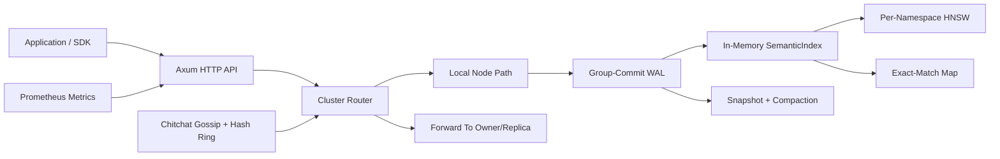

# FastRecall
A standalone service to return cached responses for semantically similar queries.

I inspected the repo read-only and did not create a project directory or generate code.

**Core Idea**
FastRecall is a standalone Rust HTTP service for semantic LLM response caching. Your app sends an embedding plus metadata; FastRecall returns a cached response if either the text exactly matches a prior query or the vector is close enough in cosine/HNSW space. It is intentionally a service, not an in-process library, so many apps/languages can share one cache and the cache survives app restarts.

**Repository Shape**
The main product is the Rust crate in `src/`: `main.rs` wires startup, config, WAL replay, clustering, TTL reaping, metrics, and the Axum router; `server.rs` owns HTTP routes and request flows; `index.rs` owns the semantic cache data structure; `wal.rs` owns persistence and group commit; `cluster.rs`, `ring.rs`, `router.rs`, and `failure_detector.rs` own distribution; `snapshot.rs`, `metrics.rs`, `auth.rs`, and `tls.rs` are operational/security support. The crate uses Tokio, Axum, hnsw_rs, Chitchat, Reqwest/Rustls, Bincode, Serde, and related libraries. 

**API Surface**
The public API is centered on `POST /insert`, `POST /query`, `DELETE /entry/:uuid`, `POST /admin/invalidate`, `/health`, `/stats`, `/metrics`, `/cluster/status`, and `/admin/compact`; internal cluster/read-repair endpoints are `/internal/entry/:uuid` and `/internal/read-repair`. Requests carry embeddings, `model_id`, optional `query_text`, optional `cache_scope`, and optional `conversation_id`. Responses distinguish normal ANN hits from exact-match hits and can report whether a conversation lookup hit the conversation namespace or global fallback.

**The Most Important Design Choice**
Writes are WAL-first. Handlers do not directly mutate the cache index on insert. They build a `WalEntry`, send it to a single group-commit WAL task over an async channel, and wait for a oneshot response. The WAL task stamps sequence numbers, writes a batch as newline-delimited JSON, fsyncs once, then applies each entry to the in-memory index under one write lock. This is how it gets durability without fsyncing separately for every concurrent 

**Startup Flow**
On boot, the service loads config, creates or derives a node ID, computes the snapshot path from the WAL path, initializes an empty `SemanticIndex`, tries to load a snapshot first, then replays only WAL entries newer than the snapshot watermark. Tombstone entries remove existing UUIDs during replay. After replay, it runs a startup expiry pass before binding the listener, opens the WAL at the recovered sequence number, starts the group-commit task, optionally starts clustering/TLS, starts the TTL reaper, builds `AppState`, and finally serves HTTP.

**Index Internals**
The top-level `SemanticIndex` is a map of namespace string to `NamespacedIndex`. Each namespace owns its own HNSW graph and side tables, so vectors from different models/scopes/conversations are never compared. A `NamespacedIndex` stores an HNSW index, `internal_id -> CacheEntry`, `uuid -> internal_id`, a set of evicted "ghost" internal IDs, and `normalized_query_text -> uuid` for exact matches.

**Query Path**
A query first validates embedding size, threshold, and `model_id`. In cluster mode, if the current node is not the owner for the embedding, it forwards the request to the owner. Locally, if `conversation_id` exists, it searches the conversation namespace first and falls back to the base namespace; otherwise it searches only the base namespace. Inside a namespace, exact-match lookup runs before HNSW. If exact lookup misses, HNSW returns nearest candidates, skips ghost/expired entries, checks threshold, then returns the cached response.

**Namespace Model**
`model_id` is mandatory because embeddings from different models or dimensions cannot safely share a vector space. `cache_scope` turns `model_id` into `model_id::scope`, which gives tenant/user/system-prompt isolation. `conversation_id` appends `::conv_{id}` to the base namespace; inserts with a conversation ID go only into that conversation namespace, while queries with that ID try conversation first and then global/base fallback. 

**Durability, Snapshots, and Deletes**
The WAL entry contains UUID, embedding, response, query text, namespace/model ID, sequence number, inserted timestamp, tombstone flag, and optional expiry timestamp. Snapshots store live entries in a binary format with a magic header, version, WAL sequence watermark, and entry count; compaction writes the snapshot and truncates the WAL while keeping the sequence counter moving forward. Deletes, TTL expiry, LRU eviction, and semantic invalidation all persist as tombstones so deleted entries do not reappear after restart. 

**Eviction and TTL**
Because hnsw_rs does not remove nodes from the graph, deletion marks internal IDs as ghost nodes and filters them out during query. If the ghost ratio exceeds the rebuild threshold, the namespace HNSW is rebuilt from live entries. LRU eviction happens after insert batches when `max_entries_per_namespace` is configured. TTL expiry is enforced both inline during queries and proactively by a background reaper that removes expired entries and writes tombstones. 

**Cluster Architecture**
Cluster mode uses Chitchat gossip for membership/address discovery and a consistent hash ring for ownership. The ring hashes the first two floats of the embedding into a key, walks virtual nodes clockwise, and can return one owner or N replica owners. Inserts are synchronously replicated to the replica set with one coordinator-generated UUID; queries route to the owner; admin deletes/invalidation fan out to peers.

**Failure Handling and Read Repair**
A phi-accrual detector tracks heartbeat inter-arrival history and transitions peers from `Alive` to `Suspected` to `Dead`; dead peers can be removed from the ring, and if they reappear in gossip they are added back. On a local query miss, the owner can ask non-dead replicas in parallel; if one has a hit, the client gets that hit immediately while a background task fetches the full entry and reinserts it through the WAL path.

**Security and Operations**
Bearer auth is optional via `FastRecall_AUTH_TOKEN`; `/health` and `/metrics` remain unauthenticated while data/admin routes require `Authorization: Bearer ...`. Cluster mTLS is separate from public HTTP: when enabled, forwarding uses a second internal listener and a Reqwest client that trusts only the cluster CA and presents a node certificate. Metrics are Prometheus text format and include global counters, per-namespace counters, histograms, ring changes, read repairs, evictions, expirations, invalidations, exact-match hits, and peer phi values. 

**Python Client Layer**
The Python package is a thin synchronous HTTP client using only stdlib for the base client. It exposes `insert`, `query`, `delete_entry`, `invalidate`, `health`, `stats`, and `cluster_status`, and forwards optional `ttl_seconds`, `cache_scope`, `conversation_id`, and `query_text`. The middleware wrappers for OpenAI and Anthropic intercept only chat/message creation, derive or accept an embedding function and `model_id`, query FastRecall first, synthesize SDK-shaped responses on hit, and call/store the real LLM response on miss.

**How To Think About Rebuilding It**
If you build the same thing, do it in layers: first single-node HTTP API plus in-memory namespaced HNSW; then WAL-first inserts; then snapshots/compaction; then exact match, TTL, deletion, invalidation, LRU, and metrics; then clustering with hash-ring routing and synchronous replication; then read repair and failure detection; finally Python wrappers and integrations. The hard parts are not the HTTP routes themselves, but preserving the invariants: one WAL writer, namespace isolation, UUID consistency across replicas, tombstones for every removal path, and no cache hit across incompatible embedding spaces.
