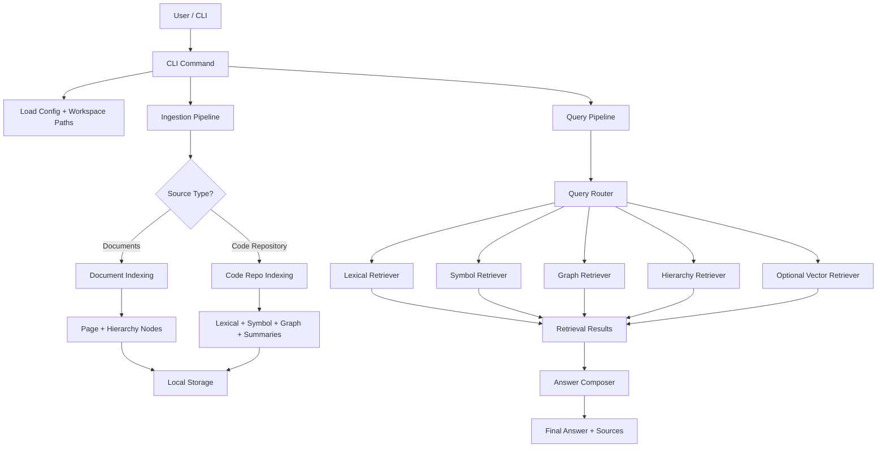
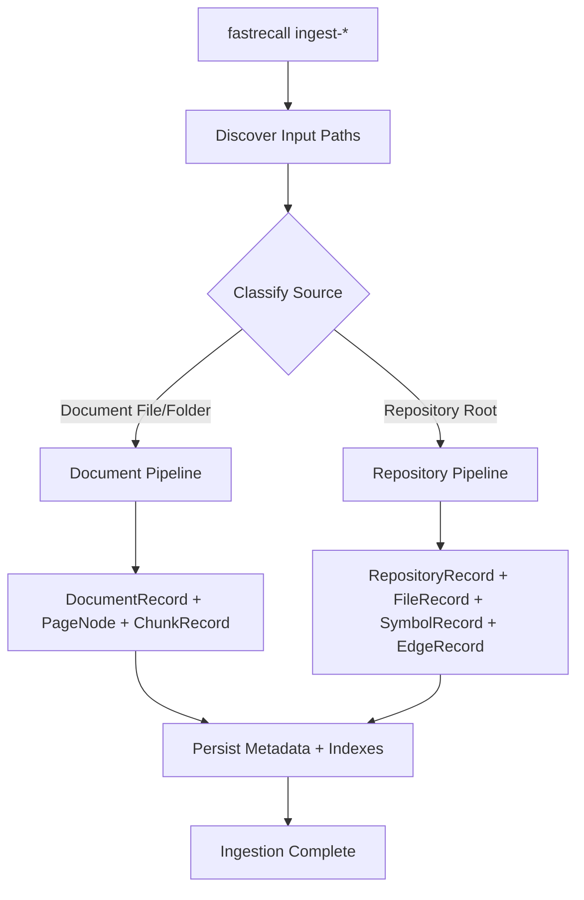
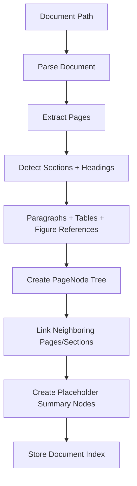
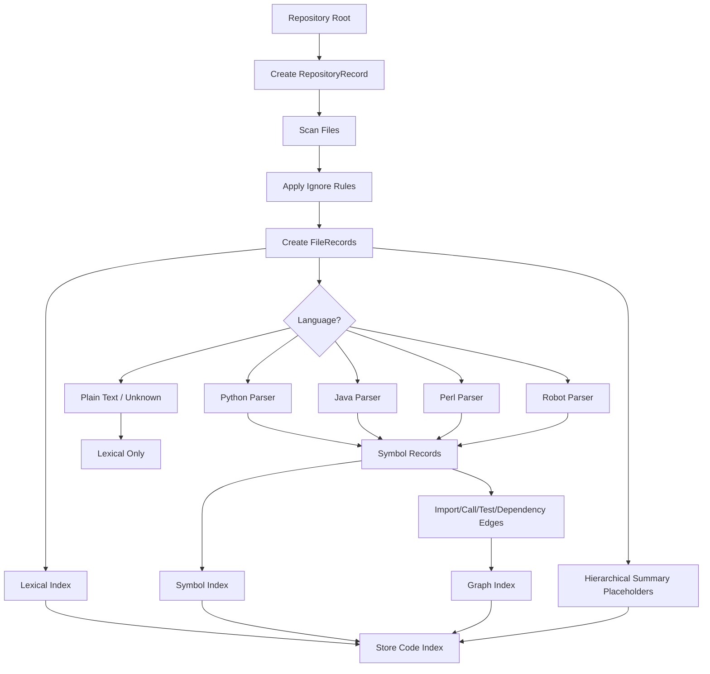
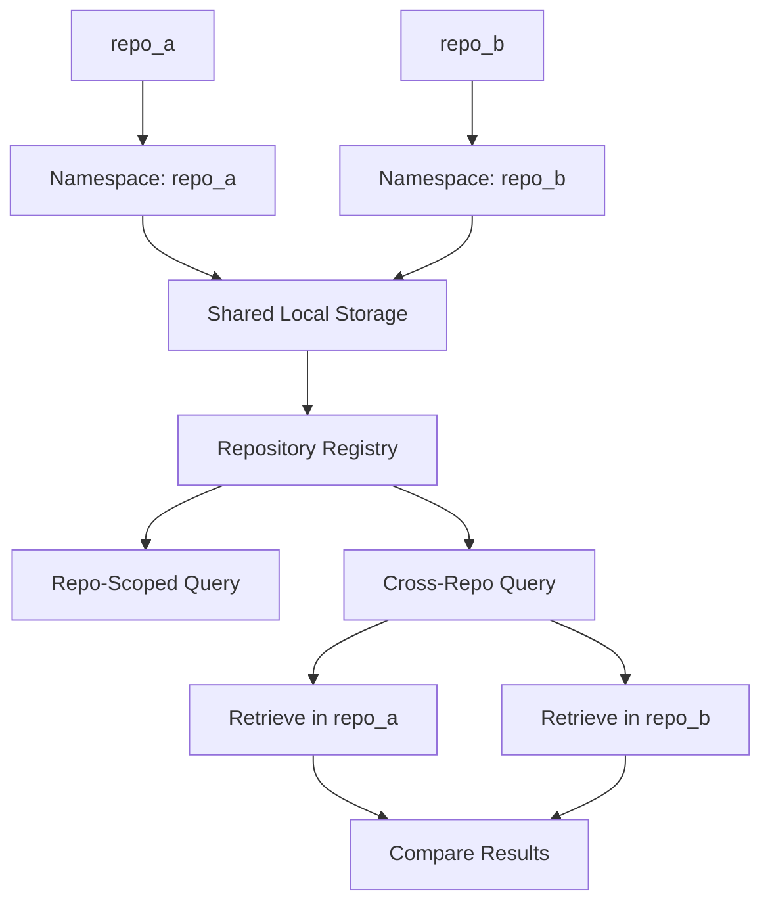
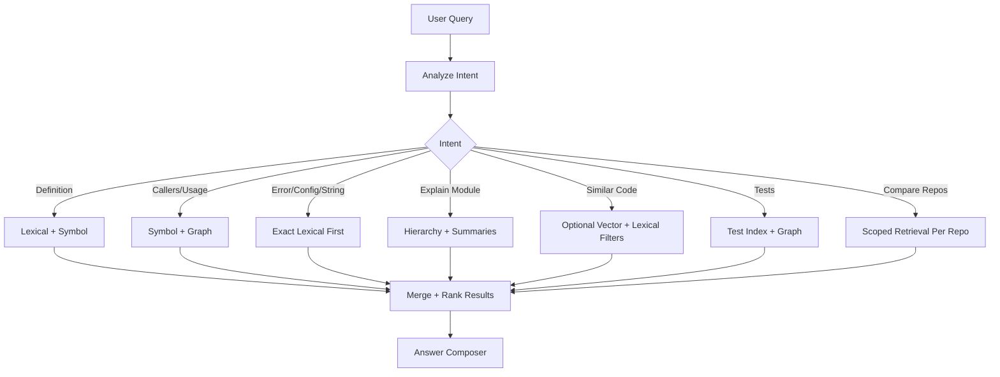
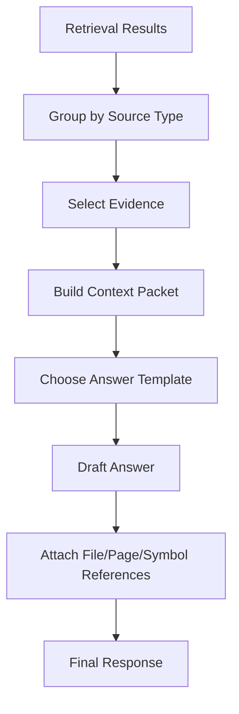

# Flowcharts

## Entire System

```mermaid
flowchart TD
  User["User / CLI"] --> Command["CLI Command"]
  Command --> Config["Load Config + Workspace Paths"]
  Command --> Ingest["Ingestion Pipeline"]
  Command --> Query["Query Pipeline"]

  Ingest --> SourceType{"Source Type?"}
  SourceType -->|Documents| DocIndex["Document Indexing"]
  SourceType -->|Code Repository| CodeIndex["Code Repo Indexing"]

  DocIndex --> PageTree["Page + Hierarchy Nodes"]
  CodeIndex --> CodeViews["Lexical + Symbol + Graph + Summaries"]

  PageTree --> Storage["Local Storage"]
  CodeViews --> Storage

  Query --> Router["Query Router"]
  Router --> Lexical["Lexical Retriever"]
  Router --> Symbol["Symbol Retriever"]
  Router --> Graph["Graph Retriever"]
  Router --> Hierarchy["Hierarchy Retriever"]
  Router --> Vector["Optional Vector Retriever"]

  Lexical --> Results["Retrieval Results"]
  Symbol --> Results
  Graph --> Results
  Hierarchy --> Results
  Vector --> Results

  Results --> Compose["Answer Composer"]
  Compose --> Answer["Final Answer + Sources"]
```

## Ingestion Flow

```mermaid
flowchart TD
  Start["fastrecall ingest-*"] --> Paths["Discover Input Paths"]
  Paths --> Classify{"Classify Source"}
  Classify -->|Document File/Folder| DocPipeline["Document Pipeline"]
  Classify -->|Repository Root| RepoPipeline["Repository Pipeline"]
  DocPipeline --> DocRecords["DocumentRecord + PageNode + ChunkRecord"]
  RepoPipeline --> RepoRecords["RepositoryRecord + FileRecord + SymbolRecord + EdgeRecord"]
  DocRecords --> Persist["Persist Metadata + Indexes"]
  RepoRecords --> Persist
  Persist --> Done["Ingestion Complete"]
```

## Document Indexing Flow

```mermaid
flowchart TD
  Doc["Document Path"] --> Parse["Parse Document"]
  Parse --> Pages["Extract Pages"]
  Pages --> Sections["Detect Sections + Headings"]
  Sections --> Blocks["Paragraphs + Tables + Figure References"]
  Blocks --> PageNodes["Create PageNode Tree"]
  PageNodes --> Neighbors["Link Neighboring Pages/Sections"]
  Neighbors --> Summaries["Create Placeholder Summary Nodes"]
  Summaries --> Store["Store Document Index"]
```

## Code Repository Indexing Flow

```mermaid
flowchart TD
  Repo["Repository Root"] --> Register["Create RepositoryRecord"]
  Register --> Scan["Scan Files"]
  Scan --> Ignore["Apply Ignore Rules"]
  Ignore --> FileRecords["Create FileRecords"]
  FileRecords --> LanguageRoute{"Language?"}
  LanguageRoute --> Python["Python Parser"]
  LanguageRoute --> Java["Java Parser"]
  LanguageRoute --> Perl["Perl Parser"]
  LanguageRoute --> Robot["Robot Parser"]
  LanguageRoute --> Other["Plain Text / Unknown"]
  Python --> Symbols["Symbol Records"]
  Java --> Symbols
  Perl --> Symbols
  Robot --> Symbols
  Other --> LexicalOnly["Lexical Only"]
  Symbols --> Edges["Import/Call/Test/Dependency Edges"]
  FileRecords --> Lexical["Lexical Index"]
  Symbols --> SymbolIndex["Symbol Index"]
  Edges --> GraphIndex["Graph Index"]
  FileRecords --> Summaries["Hierarchical Summary Placeholders"]
  Lexical --> Store["Store Code Index"]
  SymbolIndex --> Store
  GraphIndex --> Store
  Summaries --> Store
```

## Multi-Repo Indexing Flow

```mermaid
flowchart TD
  RepoA["repo_a"] --> NamespaceA["Namespace: repo_a"]
  RepoB["repo_b"] --> NamespaceB["Namespace: repo_b"]
  NamespaceA --> SharedStore["Shared Local Storage"]
  NamespaceB --> SharedStore
  SharedStore --> Registry["Repository Registry"]
  Registry --> ScopedQuery["Repo-Scoped Query"]
  Registry --> CrossQuery["Cross-Repo Query"]
  CrossQuery --> RetrieveA["Retrieve in repo_a"]
  CrossQuery --> RetrieveB["Retrieve in repo_b"]
  RetrieveA --> Compare["Compare Results"]
  RetrieveB --> Compare
```

## Query Routing Flow

```mermaid
flowchart TD
  Query["User Query"] --> Analyze["Analyze Intent"]
  Analyze --> Intent{"Intent"}
  Intent -->|Definition| Def["Lexical + Symbol"]
  Intent -->|Callers/Usage| Usage["Symbol + Graph"]
  Intent -->|Error/Config/String| Exact["Exact Lexical First"]
  Intent -->|Explain Module| Explain["Hierarchy + Summaries"]
  Intent -->|Similar Code| Similar["Optional Vector + Lexical Filters"]
  Intent -->|Tests| Tests["Test Index + Graph"]
  Intent -->|Compare Repos| Compare["Scoped Retrieval Per Repo"]
  Def --> Merge["Merge + Rank Results"]
  Usage --> Merge
  Exact --> Merge
  Explain --> Merge
  Similar --> Merge
  Tests --> Merge
  Compare --> Merge
  Merge --> Compose["Answer Composer"]
```

## Answer Generation Flow

```mermaid
flowchart TD
  Results["Retrieval Results"] --> Group["Group by Source Type"]
  Group --> Evidence["Select Evidence"]
  Evidence --> Context["Build Context Packet"]
  Context --> Template["Choose Answer Template"]
  Template --> Draft["Draft Answer"]
  Draft --> Sources["Attach File/Page/Symbol References"]
  Sources --> Final["Final Response"]
```
